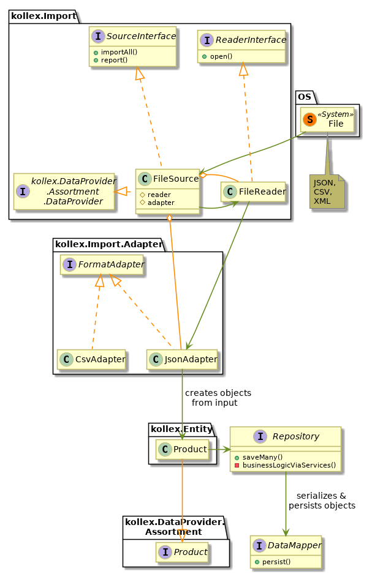
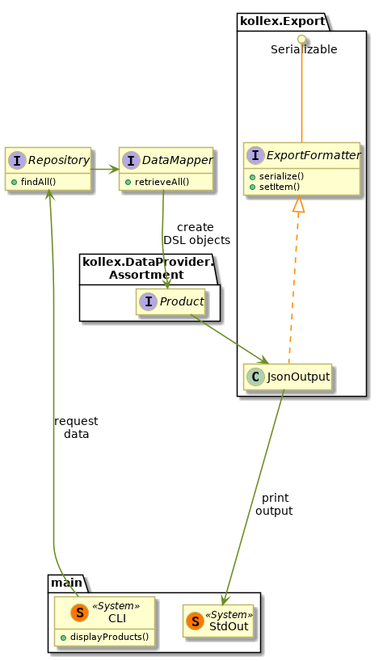

# Wholesaler Integration (kollex)

Solution by Jaroslav

## What is important

- many integrations, various formats
- importing product lists in various formats, schemas, protocols

## Task

- write a modern, maintainable, testable and extendable app
  - pragmatic, solid architecture, not over-engineered
  - fully testable for continuous integration and delivery 
  - [ ] recent PHP
  - [ ] single responsibility classes
  - [ ] use existing components
  - [ ] write unit tests
  - [ ] write behavioral tests
- extendable to new sources or data formats
  - parse and validate product lists in various formats
  - [ ] validate according to swagger
  - [ ] source abstraction
  - [ ] format adapter
  - [ ] implement schema:
    - [ ] json
    - [ ] csv 
  - [ ] implement source:
    - [ ] file-reader
  - [ ] implement output:
     - [ ] json
     - [ ] xml
  - [ ] generate model from spec
  - [ ] implement kollex\Dataprovider\Assortment\Product
    - [ ] expand as necessary
- best practices
  - [ ] describe classes briefly, avoid zero-info comments
  - [ ] defensive programming
  - [ ] code to interface
  - [ ] type hinting, return types
  - [ ] 12-factor app
- target
  - [ ] parse all data and json-encode as defined in swagger-Product
  - [ ] skip elaborate API / CLI frontend
  - [ ] provide documentation of code, concepts, possible extensions
  - [ ] provide rationale for coieces of specific structure, patterns
  - [ ] privide reasons for picking libraries / frameworks compared to other options 
  - [ ] desicions regarding test methodology
  - [ ] docker-compose up

## Desicions

- Write about normalization / sapace tradeofs
    - memory consumption
    - join complexity
    
### Default length for all fields

Given lack of more precise specifications, all text fields such as name and id are initialied with the
default lengths for varchar (255 characters).

### Public fields in product

There is no public API for export here, I own all the code in this challenge.
Therefore, there is no need to encapsulate the entity properties.

## Architecture

The task breaks down into two main actions that the user may perform

In the class diagrams, the green arrows imitate a sequence diagram
and represent the logical flow.

### Import data files scenario

We need to read files from a folder and store them in our database,
while converting to our internal schema.

### List products scenario

The entry point is from the `displayProducts()` function.

### Notes about the implementation

The `Sourceinterface` is currently overly simplistic. It is potentially very memory costly.
To make it more robust, one would support dividing the import process into several chunks
and support resuming after a failed or aborted import operation.

